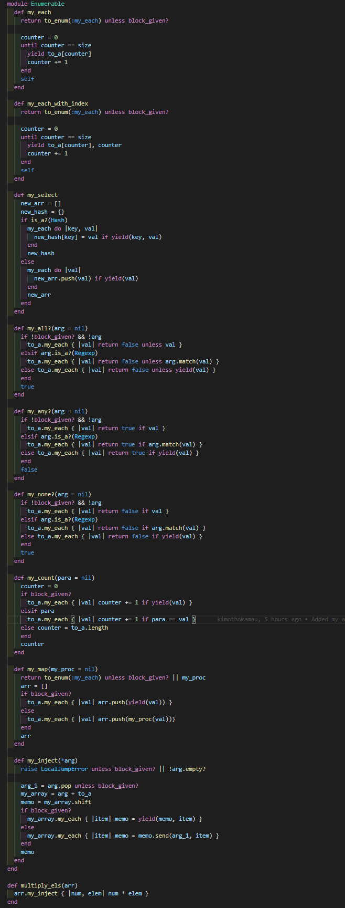

# Enumerable Methods
This is the second project of the Ruby module in Microverse software development technical curriculum. This project aims to test students knowledge of creating custom methods in pure ruby. Other used concepts include arrays, iterators, yield, and blocks.

## GETTING STARTED
To have a local version of this code running do the following:
- Clone the repository `git clone https://github.com/kimothokamau/my_enumerable_methods.git`
- Install the ruby compiler and any preferred code editor of your choice
- Navigate to the directory containing this code
- Run the command `ruby my_enumerable.rb` 

## Built With

- Ruby

## Live Demo

[Live Demo Link](https://repl.it/@kkamau/FarawayTemptingPlots#main.rb)

## Authors

Kimotho Kamau

--GitHub: [@kimothokamau](https://github.com/kimothokamau)
--LinkedIn: [LinkedIn] (https://www.linkedin.com/in/kimotho-kamau-6ab307185/)

Alexis Varela

--Github: [@alexisbec](https://github.com/alexisbec)
--LinkedIn: [LinkedIn](https://www.linkedin.com/in/alexis-varela-2584111b7/) 

##  Contributing

Contributions, issues, and feature requests are welcome!

## Show your support

Give a ⭐️ if you like this project!

## License

This project is [MIT](./LICENSE) licensed.
